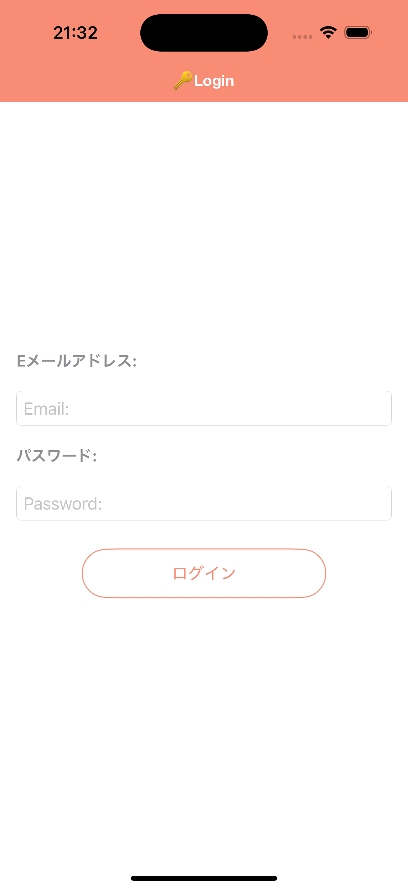
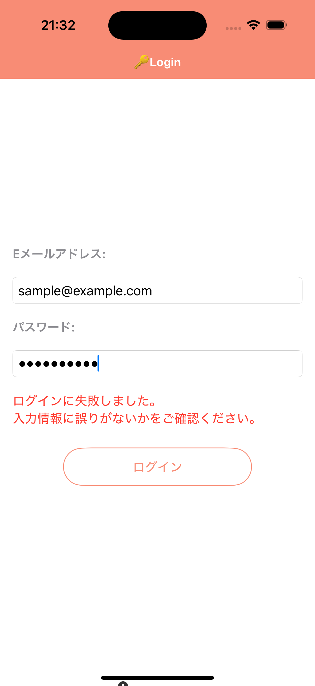
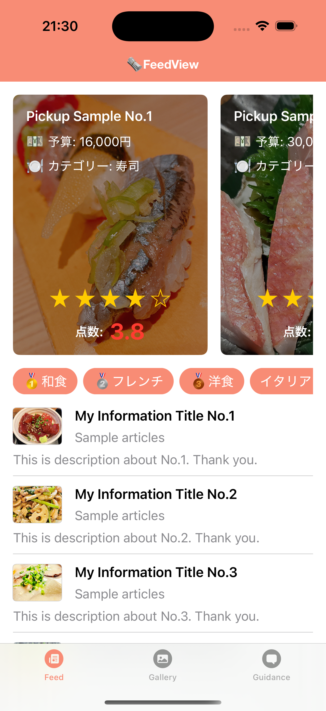
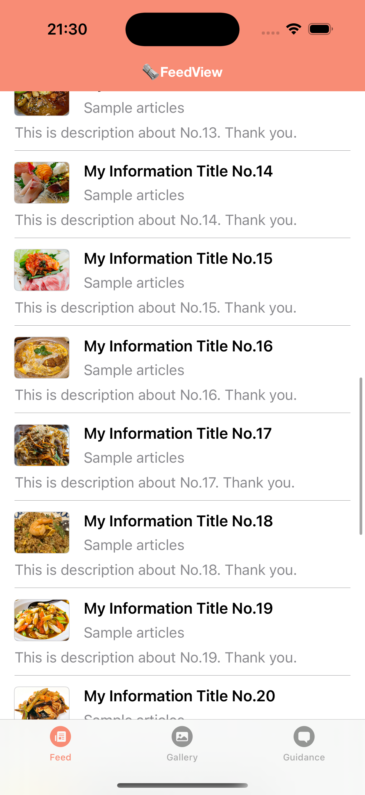
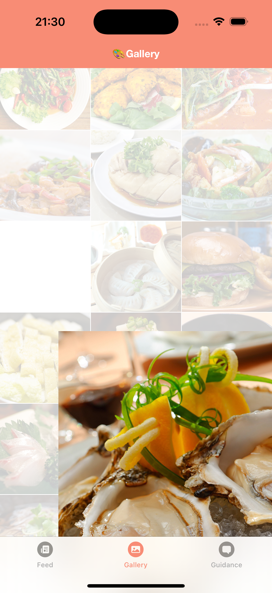
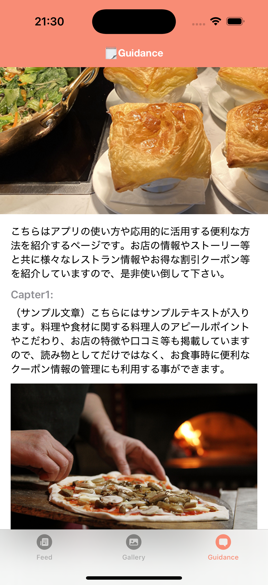
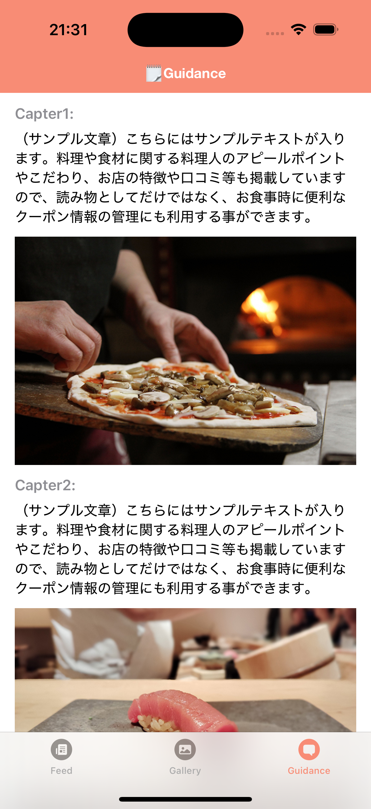
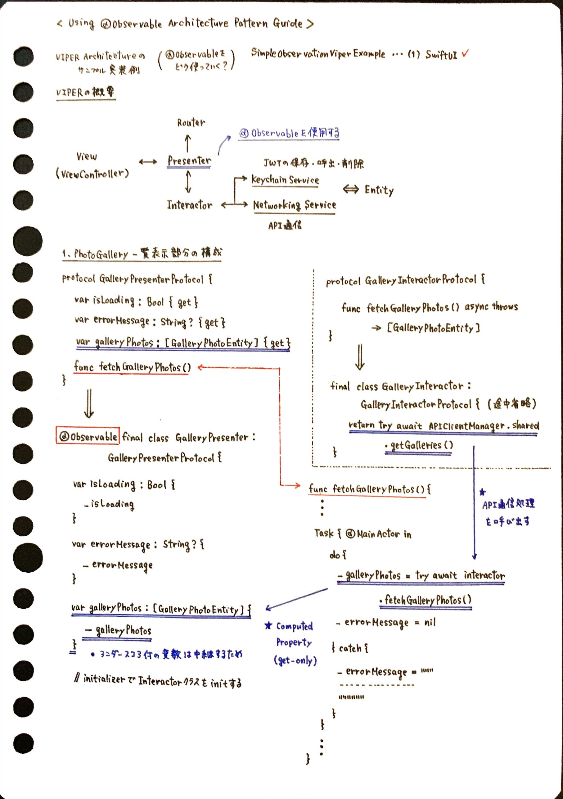
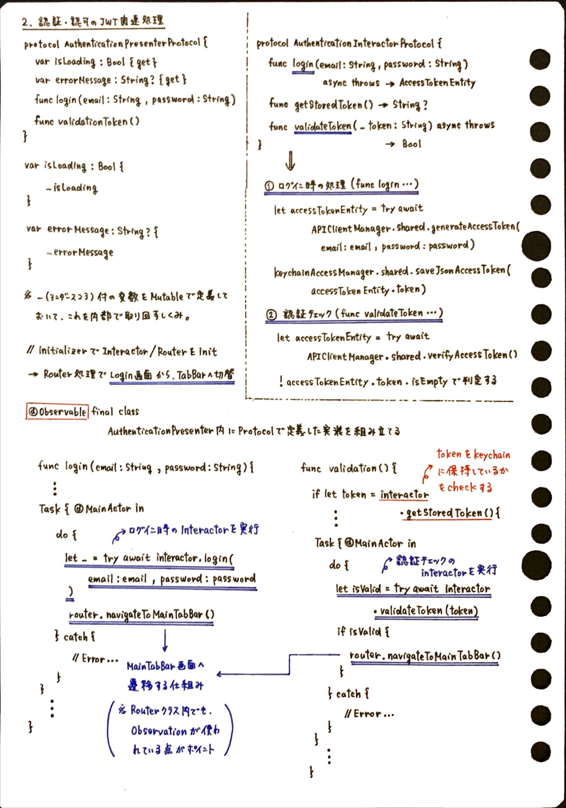

# SimpleObservationViperExample
[ING] - SwiftUI + VIPER + Observationを組み合わせた実装サンプル

iOS17から登場した、Observation Frameworkを利用してVIPERアーキテクチャでiOSアプリサンプルを開発した事例になります。

🌾 VIPERの略は下記の通りです。

- __V:__ ... View(SwiftUI)
- __I:__ ... Interactor
- __P:__ ... Presenter
- __E:__ ... Entity
- __R:__ ... Router

__【参考資料】__

- [Mastering the Basics of VIPER Design Pattern: Clear Explanation of View, Interactor, and Presenter](https://www.youtube.com/watch?v=jS01NbyPoVY&list=PLDVNuhuDdqyeSMpFdfV-gOSBMZfTdTjRH)
- [VIPERアーキテクチャ採用のTUNAG iOSアプリにSwiftUIを導入しました](https://tech.stmn.co.jp/entry/2023/09/01/132141)
- [VIPERアプリにSwiftUIを導入したら、View層の責務がより分離できた話](https://fortee.jp/iosdc-japan-2023/proposal/99cc507c-4fd4-4d5c-be72-a21a0a11bee3)
- [VIPER-Architecture for iOS project with simple demo example.](https://medium.com/cr8resume/viper-architecture-for-ios-project-with-simple-demo-example-7a07321dbd29)
- [VIPER-Architecture for iOS project with simple demo example.](https://medium.com/cr8resume/viper-architecture-for-ios-project-with-simple-demo-example-7a07321dbd29)
- [SwiftUIを活用した「レシピ」×「買い物」の新機能開発](https://techlife.cookpad.com/entry/2021/01/18/kaimono-swift-ui)

## 1. サンプル概要

### 1-1. 画面の振る舞い

ダミーのログイン処理で認証ができる様にしており、ログインが成功したならば、3画面をTabBar内でまとめて表示する画面へ遷移します。

### 1-2. 画面キャプチャ

__【認証画面】__

 

__【Feed画面】__

 

__【Gallery画面】__

 

__【Guidance画面】__

 

※この画面はVIPERアーキテクチャで作成していません。

## 2. 実装における要点まとめノート





## 3. Mockサーバー環境構築

サンプルアプリ内では、APIモックサーバーから受け取ったJSON形式のレスポンスを画面に表示する処理を実現するために、node.js製の __「json-server」__ を利用して実現しています。（※こちらはTypeScript製のものを利用しています。）

このリポジトリをClone後に下記コマンドを実行することで、自分のローカル環境で動作させる事ができます。

サンプルアプリ内にAPIモックサーバーから受け取ったJSON形式のレスポンスを画面に表示する処理を実現するために、Node.js製の「JSONServer」というものを利用して実現しています。JSONServerに関する概要や基本的な活用方法につきましては下記のリンク等を参考にすると良いかと思います。

※ 自分のLocal環境に`node.js`と`yarn`がインストールされていない場合は、まずはその準備をする必要があります

__【Local環境で再現する手順】__

```shell
# まずはMockサーバーの場所まで移動する
$ cd SimpleObservationViperExample/Backend
# 必要なpackageのインストール
$ yarn install
# Mockサーバーの実行
$ yarn start
```

※ 自分の手元でまっさらな状態から準備する場合は下記コマンドを順次実行するイメージになります。

__【Local環境で新規作成する場合の手順】__

```shell
# ⭐️ 必要な実行コマンド
# ① package.jsonの新規作成
$ yarn init -y
# ② 必要なライブラリのインストール
$ yarn add typescript
$ yarn add json-server
$ yarn add @types/json-server -D
```

※ こちらはMockサーバーを実行するために最低限必要な設定を記載した`package.json`になります。

__【package.json設定例】__

```json
{
  "name": "Backend",
  "version": "1.0.0",
  "main": "server.ts",
  "license": "MIT",
  "dependencies": {
    "body-parser": "^1.20.3",
    "fs": "^0.0.1-security",
    "helmet": "^8.0.0",
    "json-server": "^0.17.0",
    "jsonwebtoken": "^9.0.2",
    "typescript": "^5.4.2"
  },
  "scripts": {
    "start": "npx ts-node server.ts"
  },
  "devDependencies": {
    "@types/json-server": "^0.14.7",
    "@types/jsonwebtoken": "^9.0.7"
  }
}
```

### 参考資料

- [json-serverの実装に関する参考資料](https://blog.eleven-labs.com/en/json-server)
- [TypeScriptで始めるNode.js入門](https://ics.media/entry/4682/)
- [JSON ServerをCLIコマンドを使わずTypescript＆node.jsからサーバーを立てるやり方](https://deep.tacoskingdom.com/blog/151)
